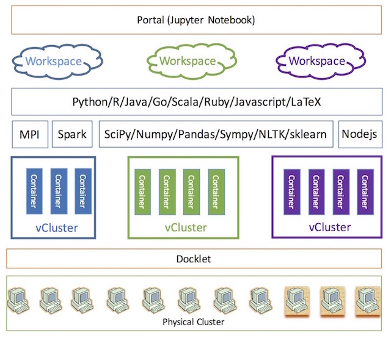

## What is Docklet ##

### Definition and Architecture ###

Docklet is an open source project from Software Engineering Institute,
Peking University. It is released uner the [New BSD License](http://directory.fsf.org/wiki/License:BSD_3Clause). Its source code is hosted in GitHub.

The goal of Docklet is to provide a solution of **Personal Development
Workspace in the Cloud** for enterprises. With the help of Docklet,
enterprises can easily virtualize their small-scale data centers,
creating virtualized clusters for their staff users, and then providing
users a customizable **Workspace** in the cloud.  Users only need a
modern **browser** to visit their own **Workspace** located in the
enterprise's Intranet from anywhere, at anytime. They can do works like
online editing source codes, debugging, testing, managing data files,
analyzing data, visualizing results, etc.

The kernel technology of Docklet is LXC virtual cluster (vcluster) that
is based on Linux Container (LXC) and software defined networks
technologies. The Docklet **vcluster** provides a virtualization
solution of physical clusters, supports the installation and running of
most existing Linux applications. 

Based on vcluster, Docklet provides users their **Personal Workspace**. 
Users visit their Workspace throught the integrated [Jupyper Notebook](https://github.com/jupyter/notebook) to do most development tasks.

The architecture of Docklet is illustrated as follows:

<!--

-->

### Docklet and Docker ###

Docklet has no direct relationship with [Docker](https://github.com/docker/docker). They are two different projects, with totally different design goals.

The goal of Docker is to provide a lightweight operating system
virualization solution. It is in the [IaaS layer](https://en.wikipedia.org/wiki/Cloud_computing) of cloud computing architecture.
Docker encapsulates LXC to make LXC easy, 
so that [the users can operate a Docker container as simple as operate
a fast and lightweight virtual machine](https://www.gitbook.com/book/yeasy/docker_practice). Although later on Docker has clustering component, 
it in essence still focuses on single node operating system layer.  

The goal of Docklet is to provide **Personal Development Workspace in
the Cloud** solution. It covers all the [SaaS, PaaS and IaaS layer](https://en.wikipedia.org/wiki/Cloud_computing) of cloud computing architecture.
The basic of Docklet is LXC vcluster, but not Docker container. For
Docklet users, what they face directly is their Workspace. They use
browser to do software development, debuging and testing, etc, using tools
Docklet provide, working in a high layer.
